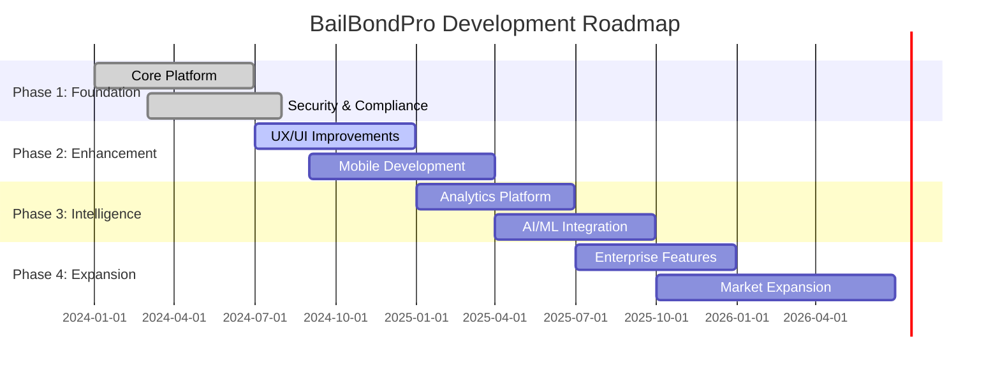
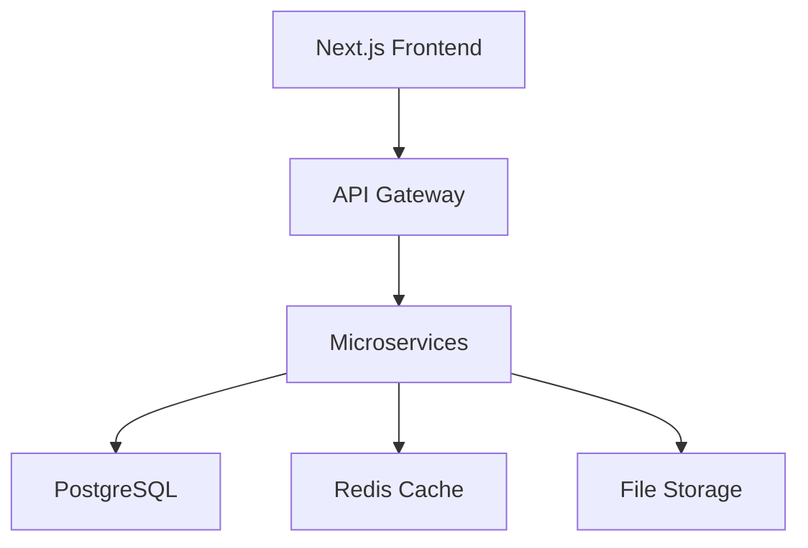
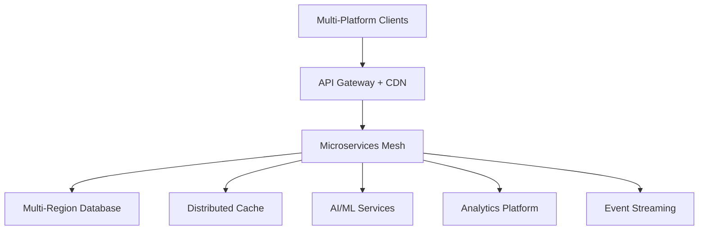

# BailBondPro Roadmap

## 🎯 Vision & Mission

### Vision Statement
To become the leading digital platform that revolutionizes the bail bond industry through innovative technology, streamlined processes, and exceptional user experiences while maintaining the highest standards of compliance and security.

### Mission Statement
BailBondPro empowers bail bond agencies with cutting-edge technology to efficiently manage clients, streamline operations, ensure regulatory compliance, and deliver superior service to defendants and their families during critical times.

### Core Values
- **Reliability**: Dependable systems that agencies can trust
- **Compliance**: Unwavering commitment to legal and regulatory requirements
- **Innovation**: Continuous improvement through technology advancement
- **Accessibility**: Inclusive design for all users and stakeholders
- **Security**: Protecting sensitive data and maintaining privacy
- **Transparency**: Clear communication and open development processes

## 📊 Current State Analysis

### Strengths
- ✅ Solid technical foundation with modern tech stack
- ✅ Comprehensive feature set covering core business needs
- ✅ Strong security and compliance framework
- ✅ Scalable architecture ready for growth
- ✅ Active development and maintenance

### Areas for Improvement
- 🔄 User experience optimization needed
- 🔄 Mobile application development required
- 🔄 Advanced analytics and reporting capabilities
- 🔄 Third-party integrations expansion
- 🔄 Performance optimization opportunities

### Market Position
- **Target Market**: Small to medium bail bond agencies
- **Competitive Advantage**: Modern technology, compliance focus, user-centric design
- **Market Size**: $2.4B bail bond industry in the US
- **Growth Opportunity**: Digital transformation of traditional industry

## 🗺️ Strategic Roadmap Overview



## 🚀 Development Phases

### Phase 1: Foundation & Core Platform (Q1-Q2 2024) ✅ COMPLETED

**Objective**: Establish robust foundation with essential features

#### Completed Deliverables
- ✅ **Core Platform Architecture**
  - Modern tech stack implementation (Next.js, TypeScript, PostgreSQL)
  - Microservices architecture with API-first design
  - Comprehensive security framework
  - Database design and optimization

- ✅ **Essential Features**
  - Client management system
  - Contract creation and management
  - Payment processing integration
  - Document management
  - User authentication and authorization

- ✅ **Compliance Framework**
  - FCRA compliance implementation
  - Data protection and privacy controls
  - Audit logging and reporting
  - Regulatory compliance monitoring

- ✅ **Security Implementation**
  - End-to-end encryption
  - Multi-factor authentication
  - Role-based access control
  - Security monitoring and alerting

#### Key Metrics Achieved
- 🎯 **Performance**: <100ms API response times
- 🎯 **Security**: Zero critical vulnerabilities
- 🎯 **Reliability**: 99.9% uptime
- 🎯 **Compliance**: 100% FCRA compliance

### Phase 2: Enhancement & Mobile (Q3 2024 - Q1 2025) 🔄 IN PROGRESS

**Objective**: Improve user experience and expand platform accessibility

#### Current Progress (75% Complete)
- 🔄 **User Experience Optimization**
  - Modern UI/UX redesign with improved workflows
  - Accessibility improvements (WCAG 2.1 AA compliance)
  - Performance optimization and Core Web Vitals
  - Responsive design enhancements

- 🔄 **Mobile Application Development**
  - React Native cross-platform app
  - Offline capability for critical functions
  - Push notifications and real-time updates
  - Biometric authentication

#### Upcoming Deliverables (Q4 2024 - Q1 2025)
- 📱 **Mobile App Features**
  - Client check-in and status updates
  - Document capture and upload
  - Payment processing on mobile
  - GPS tracking and location services

- 🎨 **Advanced UI Components**
  - Interactive dashboards and charts
  - Drag-and-drop interfaces
  - Advanced search and filtering
  - Customizable user preferences

#### Success Metrics
- 🎯 **User Satisfaction**: >4.5/5 rating
- 🎯 **Mobile Adoption**: 60% of users on mobile
- 🎯 **Performance**: Lighthouse score >95
- 🎯 **Accessibility**: WCAG 2.1 AA compliance

### Phase 3: Intelligence & Analytics (Q1-Q3 2025) 📋 PLANNED

**Objective**: Implement advanced analytics and AI-powered features

#### Planned Deliverables

##### Advanced Analytics Platform
- 📊 **Business Intelligence Dashboard**
  - Real-time KPI monitoring and alerts
  - Predictive analytics for risk assessment
  - Financial performance tracking
  - Client behavior analysis

- 📈 **Reporting & Insights**
  - Automated report generation
  - Custom report builder
  - Data visualization tools
  - Trend analysis and forecasting

##### AI/ML Integration
- 🤖 **Risk Assessment AI**
  - Machine learning models for flight risk prediction
  - Automated credit scoring and evaluation
  - Pattern recognition for fraud detection
  - Behavioral analysis algorithms

- 💬 **Intelligent Automation**
  - Chatbot for client support
  - Automated document processing
  - Smart notification system
  - Workflow optimization suggestions

##### Data Platform
- 🗄️ **Data Warehouse**
  - Centralized data repository
  - ETL pipelines for data processing
  - Data quality monitoring
  - Historical data analysis

#### Technology Stack Additions
```typescript
// AI/ML Services
interface AIServices {
  riskAssessment: RiskAssessmentEngine;
  documentProcessing: DocumentAI;
  chatbot: ConversationalAI;
  predictiveAnalytics: PredictiveEngine;
}

// Analytics Platform
interface AnalyticsPlatform {
  dataWarehouse: DataWarehouse;
  reportingEngine: ReportingService;
  visualization: ChartingLibrary;
  realTimeMetrics: MetricsCollector;
}
```

#### Success Metrics
- 🎯 **Prediction Accuracy**: >85% for risk assessment
- 🎯 **Automation**: 40% reduction in manual tasks
- 🎯 **Insights**: 100% of agencies using analytics
- 🎯 **ROI**: 25% improvement in operational efficiency

### Phase 4: Enterprise & Expansion (Q3 2025 - Q2 2026) 🔮 FUTURE

**Objective**: Scale to enterprise customers and expand market reach

#### Planned Features

##### Enterprise Capabilities
- 🏢 **Multi-Tenant Architecture**
  - White-label solutions for large agencies
  - Custom branding and configuration
  - Advanced user management
  - Enterprise-grade SLAs

- 🔗 **Advanced Integrations**
  - Court system APIs
  - Law enforcement databases
  - Financial institution connections
  - Government compliance systems

##### Market Expansion
- 🌍 **Geographic Expansion**
  - Multi-state compliance support
  - Localization for different jurisdictions
  - International market exploration
  - Regional partnership programs

- 📈 **Vertical Expansion**
  - Insurance company integrations
  - Legal services partnerships
  - Financial services connections
  - Government agency solutions

#### Success Metrics
- 🎯 **Enterprise Customers**: 50+ large agencies
- 🎯 **Market Share**: 15% of addressable market
- 🎯 **Revenue Growth**: 200% year-over-year
- 🎯 **Geographic Coverage**: 25+ states

## 🎯 Feature Priorities

### High Priority (Next 6 Months)
1. **Mobile App Completion** - Critical for field operations
2. **Performance Optimization** - Ensure scalability
3. **Advanced Search** - Improve user productivity
4. **Notification System** - Real-time updates and alerts
5. **Backup & Recovery** - Data protection and business continuity

### Medium Priority (6-12 Months)
1. **Analytics Dashboard** - Business intelligence capabilities
2. **API Marketplace** - Third-party integrations
3. **Workflow Automation** - Process optimization
4. **Advanced Reporting** - Custom report generation
5. **Multi-Language Support** - Accessibility improvements

### Low Priority (12+ Months)
1. **AI Risk Assessment** - Machine learning capabilities
2. **Blockchain Integration** - Enhanced security and transparency
3. **IoT Device Support** - GPS tracking and monitoring
4. **Voice Interface** - Accessibility and convenience
5. **Predictive Analytics** - Advanced business insights

## 🛠️ Technical Roadmap

### Infrastructure Evolution

#### Current Architecture (2024)


#### Target Architecture (2026)


### Technology Adoption Timeline

#### 2024 Q4
- **Performance**: Implement edge caching and CDN
- **Mobile**: Complete React Native app development
- **Security**: Advanced threat detection
- **Monitoring**: Enhanced observability stack

#### 2025 Q1-Q2
- **AI/ML**: Machine learning model development
- **Analytics**: Data warehouse implementation
- **Integration**: API marketplace launch
- **Scalability**: Kubernetes orchestration

#### 2025 Q3-Q4
- **Intelligence**: AI-powered features rollout
- **Automation**: Workflow optimization tools
- **Enterprise**: Multi-tenant architecture
- **Global**: International expansion support

#### 2026 Q1-Q2
- **Innovation**: Emerging technology adoption
- **Scale**: Enterprise-grade infrastructure
- **Intelligence**: Advanced AI capabilities
- **Market**: New vertical expansion

## 📈 Success Metrics & KPIs

### Product Metrics

#### User Engagement
- **Daily Active Users (DAU)**: Target 80% of registered users
- **Session Duration**: Average 25+ minutes per session
- **Feature Adoption**: 70%+ adoption of core features
- **User Retention**: 90% monthly retention rate

#### Performance Metrics
- **Page Load Time**: <2 seconds for all pages
- **API Response Time**: <100ms for 95% of requests
- **Uptime**: 99.9% availability SLA
- **Error Rate**: <0.1% application errors

#### Business Metrics
- **Customer Acquisition Cost (CAC)**: <$500 per agency
- **Customer Lifetime Value (CLV)**: >$50,000 per agency
- **Monthly Recurring Revenue (MRR)**: 20% month-over-month growth
- **Churn Rate**: <5% monthly churn

### Technical Metrics

#### Code Quality
- **Test Coverage**: >90% for critical paths
- **Code Review**: 100% of changes reviewed
- **Security Vulnerabilities**: Zero critical, <5 high
- **Technical Debt**: <10% of development time

#### Operational Metrics
- **Deployment Frequency**: Daily deployments
- **Lead Time**: <2 hours from commit to production
- **Mean Time to Recovery (MTTR)**: <30 minutes
- **Change Failure Rate**: <5% of deployments

## 🎨 User Experience Roadmap

### Design System Evolution

#### Phase 1: Foundation (Completed)
- ✅ Component library establishment
- ✅ Design tokens and theming
- ✅ Accessibility baseline
- ✅ Responsive design patterns

#### Phase 2: Enhancement (In Progress)
- 🔄 Advanced interaction patterns
- 🔄 Micro-animations and transitions
- 🔄 Dark mode support
- 🔄 Customizable dashboards

#### Phase 3: Intelligence (Planned)
- 📋 Personalized user experiences
- 📋 Adaptive interfaces
- 📋 Voice and gesture controls
- 📋 AI-powered recommendations

### Accessibility Roadmap

#### Current State (WCAG 2.1 A)
- ✅ Keyboard navigation support
- ✅ Screen reader compatibility
- ✅ Color contrast compliance
- ✅ Alternative text for images

#### Target State (WCAG 2.2 AA+)
- 🎯 Advanced keyboard shortcuts
- 🎯 Voice control integration
- 🎯 High contrast mode
- 🎯 Cognitive accessibility features

## 🔒 Security & Compliance Roadmap

### Security Enhancements

#### 2024 Q4
- **Zero Trust Architecture**: Complete implementation
- **Advanced Threat Detection**: AI-powered security monitoring
- **Penetration Testing**: Quarterly security assessments
- **Compliance Automation**: Automated compliance checking

#### 2025
- **Quantum-Resistant Encryption**: Future-proof cryptography
- **Behavioral Analytics**: User behavior monitoring
- **Supply Chain Security**: Dependency vulnerability scanning
- **Privacy Engineering**: Privacy-by-design implementation

### Compliance Evolution

#### Current Compliance (2024)
- ✅ FCRA (Fair Credit Reporting Act)
- ✅ GDPR (General Data Protection Regulation)
- ✅ CCPA (California Consumer Privacy Act)
- ✅ SOC 2 Type II

#### Future Compliance (2025-2026)
- 📋 HIPAA (Health Insurance Portability and Accountability Act)
- 📋 PCI DSS (Payment Card Industry Data Security Standard)
- 📋 ISO 27001 (Information Security Management)
- 📋 FedRAMP (Federal Risk and Authorization Management Program)

## 🌐 Market Expansion Strategy

### Geographic Expansion

#### Phase 1: Regional (2024-2025)
- **Target States**: California, Texas, Florida, New York
- **Market Size**: 40% of US bail bond market
- **Regulatory Focus**: State-specific compliance requirements
- **Partnership Strategy**: Regional bail bond associations

#### Phase 2: National (2025-2026)
- **Target**: All 50 US states
- **Market Coverage**: 100% of addressable market
- **Compliance**: Multi-state regulatory framework
- **Operations**: National support infrastructure

#### Phase 3: International (2026+)
- **Target Markets**: Canada, UK, Australia
- **Localization**: Currency, language, legal frameworks
- **Partnerships**: International legal and financial partners
- **Compliance**: International data protection laws

### Vertical Expansion

#### Adjacent Markets
- **Insurance Companies**: Surety bond management
- **Legal Services**: Case management integration
- **Financial Services**: Credit and risk assessment
- **Government Agencies**: Court system integration

#### New Product Lines
- **BailBondPro Lite**: Small agency solution
- **BailBondPro Enterprise**: Large agency platform
- **BailBondPro API**: Developer platform
- **BailBondPro Analytics**: Standalone analytics solution

## 🤝 Partnership Strategy

### Technology Partners

#### Current Partners
- **Stripe**: Payment processing
- **Twilio**: Communication services
- **AWS**: Cloud infrastructure
- **Auth0**: Identity management

#### Target Partners
- **Salesforce**: CRM integration
- **Microsoft**: Office 365 integration
- **Google**: Workspace integration
- **DocuSign**: Document signing

### Industry Partners

#### Bail Bond Associations
- **National Association of Bail Agents (NABA)**
- **State bail bond associations**
- **Regional industry groups**
- **Professional certification bodies**

#### Legal and Financial
- **Court system vendors**
- **Legal software providers**
- **Financial institutions**
- **Insurance companies**

## 💰 Investment & Funding

### Current Funding Status
- **Bootstrap Phase**: Self-funded development
- **Revenue**: Subscription-based SaaS model
- **Growth**: Organic growth through customer acquisition
- **Profitability**: Target profitability by Q2 2025

### Future Funding Needs

#### Series A (2025)
- **Amount**: $5-10M
- **Purpose**: Market expansion and team growth
- **Investors**: SaaS-focused VCs, industry specialists
- **Valuation**: $50-100M target

#### Series B (2026)
- **Amount**: $20-30M
- **Purpose**: International expansion and AI development
- **Investors**: Growth equity firms, strategic investors
- **Valuation**: $200-500M target

### Revenue Projections

#### 2024 Targets
- **MRR**: $100K by year-end
- **Customers**: 200 agencies
- **ARPU**: $500/month per agency
- **Growth Rate**: 20% month-over-month

#### 2025 Projections
- **ARR**: $5M annual recurring revenue
- **Customers**: 800 agencies
- **Market Share**: 5% of addressable market
- **Team Size**: 50 employees

#### 2026 Goals
- **ARR**: $20M annual recurring revenue
- **Customers**: 2,000+ agencies
- **Market Share**: 15% of addressable market
- **International**: 10% of revenue

## 🎓 Team & Talent Strategy

### Current Team Structure
- **Engineering**: 8 developers (full-stack, mobile, DevOps)
- **Product**: 2 product managers
- **Design**: 2 UX/UI designers
- **Operations**: 3 customer success, 2 sales

### Hiring Roadmap

#### 2024 Q4 Priorities
- **Senior Frontend Developer**: React/Next.js expertise
- **Mobile Developer**: React Native specialist
- **DevOps Engineer**: Kubernetes and cloud infrastructure
- **Customer Success Manager**: Bail bond industry experience

#### 2025 Expansion
- **AI/ML Engineer**: Machine learning and data science
- **Security Engineer**: Cybersecurity and compliance
- **Sales Director**: Enterprise sales experience
- **Marketing Manager**: SaaS marketing expertise

#### 2026 Scale-Up
- **Engineering Managers**: Team leadership
- **Product Marketing**: Go-to-market strategy
- **International Team**: Global expansion support
- **Legal Counsel**: Compliance and regulatory affairs

### Culture & Values
- **Remote-First**: Distributed team with flexible work
- **Continuous Learning**: Professional development budget
- **Diversity & Inclusion**: Diverse hiring and inclusive culture
- **Work-Life Balance**: Sustainable work practices

## 🔄 Risk Management

### Technical Risks

#### High Priority Risks
1. **Scalability Challenges**
   - **Risk**: System performance degradation under load
   - **Mitigation**: Load testing, auto-scaling, performance monitoring
   - **Contingency**: Cloud infrastructure scaling, caching optimization

2. **Security Vulnerabilities**
   - **Risk**: Data breaches or security incidents
   - **Mitigation**: Security audits, penetration testing, monitoring
   - **Contingency**: Incident response plan, cyber insurance

3. **Third-Party Dependencies**
   - **Risk**: Critical service outages or API changes
   - **Mitigation**: Redundant providers, SLA monitoring, fallback systems
   - **Contingency**: Alternative service providers, offline capabilities

#### Medium Priority Risks
1. **Technology Obsolescence**
   - **Risk**: Core technologies becoming outdated
   - **Mitigation**: Regular technology reviews, gradual migrations
   - **Contingency**: Modernization roadmap, technical debt management

2. **Talent Retention**
   - **Risk**: Key team members leaving
   - **Mitigation**: Competitive compensation, career development, culture
   - **Contingency**: Knowledge documentation, cross-training, hiring pipeline

### Business Risks

#### Market Risks
1. **Regulatory Changes**
   - **Risk**: New compliance requirements affecting operations
   - **Mitigation**: Regulatory monitoring, legal counsel, industry engagement
   - **Contingency**: Rapid compliance implementation, feature flags

2. **Economic Downturn**
   - **Risk**: Reduced customer spending and acquisition
   - **Mitigation**: Diverse customer base, flexible pricing, cost management
   - **Contingency**: Reduced burn rate, extended runway, pivot options

3. **Competitive Pressure**
   - **Risk**: New competitors or existing players improving offerings
   - **Mitigation**: Innovation focus, customer relationships, differentiation
   - **Contingency**: Feature acceleration, pricing strategy, partnerships

## 📅 Milestone Timeline

### 2024 Q4 Milestones
- ✅ **October**: Mobile app beta release
- 🔄 **November**: Performance optimization completion
- 📋 **December**: Advanced search and filtering

### 2025 Q1 Milestones
- 📋 **January**: Mobile app production release
- 📋 **February**: Analytics dashboard MVP
- 📋 **March**: API marketplace launch

### 2025 Q2 Milestones
- 📋 **April**: AI risk assessment beta
- 📋 **May**: Enterprise features rollout
- 📋 **June**: Multi-state compliance support

### 2025 Q3 Milestones
- 📋 **July**: Workflow automation platform
- 📋 **August**: Advanced reporting suite
- 📋 **September**: International expansion pilot

### 2025 Q4 Milestones
- 📋 **October**: AI-powered features production
- 📋 **November**: Enterprise customer onboarding
- 📋 **December**: Series A funding completion

## 🎯 Success Criteria

### Short-Term Success (6 months)
- ✅ **Product**: Mobile app launched and adopted
- ✅ **Performance**: Sub-100ms API response times maintained
- ✅ **Growth**: 300+ active agencies on platform
- ✅ **Revenue**: $150K monthly recurring revenue

### Medium-Term Success (18 months)
- 🎯 **Market**: 5% market share in target states
- 🎯 **Product**: AI-powered features in production
- 🎯 **Team**: 30+ team members across all functions
- 🎯 **Revenue**: $2M annual recurring revenue

### Long-Term Success (36 months)
- 🎯 **Market**: Leading platform in bail bond industry
- 🎯 **Geographic**: National presence across all states
- 🎯 **Innovation**: Industry-recognized technology leader
- 🎯 **Financial**: $20M+ annual recurring revenue

## 📞 Stakeholder Communication

### Internal Communication
- **Weekly**: Team standups and progress updates
- **Monthly**: All-hands meetings and roadmap reviews
- **Quarterly**: Board meetings and strategic planning
- **Annually**: Company retreat and vision alignment

### External Communication
- **Monthly**: Customer newsletter and feature updates
- **Quarterly**: Industry conference presentations
- **Annually**: User conference and roadmap sharing
- **Ongoing**: Blog posts and thought leadership

### Feedback Channels
- **Product Feedback**: In-app feedback widget, user interviews
- **Customer Support**: Help desk, live chat, phone support
- **Community**: User forums, social media, industry events
- **Partners**: Regular partner meetings and collaboration sessions

---

## 📋 Conclusion

This roadmap represents our strategic vision for transforming the bail bond industry through innovative technology and exceptional user experiences. Our phased approach ensures sustainable growth while maintaining our commitment to security, compliance, and customer success.

### Key Principles
1. **Customer-Centric**: Every decision prioritizes customer value and success
2. **Quality-First**: No compromise on security, performance, or reliability
3. **Agile Execution**: Iterative development with continuous feedback
4. **Sustainable Growth**: Balanced expansion with operational excellence
5. **Innovation Leadership**: Pioneering new solutions for industry challenges

### Next Steps
1. **Review and Approve**: Stakeholder review and roadmap approval
2. **Resource Allocation**: Team and budget planning for upcoming phases
3. **Execution Planning**: Detailed sprint planning and milestone tracking
4. **Communication**: Roadmap sharing with customers and partners
5. **Monitoring**: Regular progress tracking and roadmap adjustments

### Contact Information
- **Product Team**: product@bailbondpro.com
- **Engineering**: engineering@bailbondpro.com
- **Customer Success**: success@bailbondpro.com
- **General Inquiries**: info@bailbondpro.com

---

**Document Version**: 1.0.0  
**Last Updated**: November 2024  
**Next Review**: February 2025  
**Owner**: Product Management Team

*This roadmap is a living document that will be updated regularly based on market feedback, technical discoveries, and business priorities.*