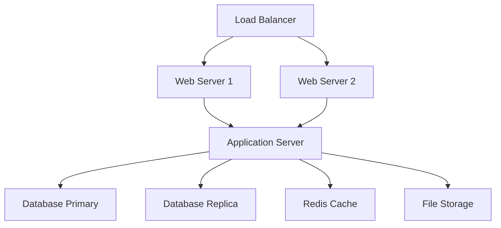

# Scaling Guide

This document provides comprehensive guidance for scaling the BailBondPro bail bond management system to handle increased load, user growth, and data volume while maintaining performance and reliability.

## Table of Contents

- [Overview](#overview)
- [Scaling Strategy](#scaling-strategy)
- [Horizontal Scaling](#horizontal-scaling)
- [Vertical Scaling](#vertical-scaling)
- [Database Scaling](#database-scaling)
- [Load Balancing](#load-balancing)
- [Caching Strategies](#caching-strategies)
- [CDN Implementation](#cdn-implementation)
- [Microservices Architecture](#microservices-architecture)
- [Auto-Scaling](#auto-scaling)
- [Performance Monitoring](#performance-monitoring)
- [Capacity Planning](#capacity-planning)
- [Cost Optimization](#cost-optimization)

## Overview

### Current Architecture



### Scaling Objectives

- **Performance**: Maintain sub-200ms response times under load
- **Availability**: Achieve 99.9% uptime with zero single points of failure
- **Scalability**: Support 10x user growth without architecture changes
- **Cost Efficiency**: Optimize resource utilization and operational costs
- **Reliability**: Ensure data consistency and system stability

### Growth Projections

| Metric | Current | 6 Months | 1 Year | 2 Years |
|--------|---------|----------|--------|---------|
| Active Users | 100 | 500 | 1,000 | 2,500 |
| Daily Transactions | 1,000 | 5,000 | 10,000 | 25,000 |
| Database Size | 10 GB | 50 GB | 100 GB | 250 GB |
| API Requests/Day | 50K | 250K | 500K | 1.25M |
| Concurrent Users | 50 | 250 | 500 | 1,250 |

## Scaling Strategy

### Scaling Principles

1. **Scale Out, Not Up**: Prefer horizontal scaling over vertical scaling
2. **Stateless Design**: Keep application servers stateless for easy scaling
3. **Database Optimization**: Optimize queries before adding hardware
4. **Caching First**: Implement caching at multiple layers
5. **Monitoring Driven**: Scale based on metrics, not assumptions

### Scaling Phases

#### Phase 1: Optimization (0-500 users)
- Database query optimization
- Application-level caching
- CDN implementation
- Code optimization

#### Phase 2: Horizontal Scaling (500-1,500 users)
- Multiple application servers
- Load balancer implementation
- Database read replicas
- Redis clustering

#### Phase 3: Microservices (1,500+ users)
- Service decomposition
- API gateway
- Container orchestration
- Advanced monitoring

## Horizontal Scaling

### Application Server Scaling

```yaml
# docker-compose.scale.yml
version: '3.8'
services:
  app:
    image: bailbondpro:latest
    deploy:
      replicas: 3
      resources:
        limits:
          cpus: '1.0'
          memory: 1G
        reservations:
          cpus: '0.5'
          memory: 512M
      restart_policy:
        condition: on-failure
        delay: 5s
        max_attempts: 3
    environment:
      - NODE_ENV=production
      - DATABASE_URL=${DATABASE_URL}
      - REDIS_URL=${REDIS_URL}
    networks:
      - app-network

  nginx:
    image: nginx:alpine
    ports:
      - "80:80"
      - "443:443"
    volumes:
      - ./nginx.conf:/etc/nginx/nginx.conf
      - ./ssl:/etc/ssl
    depends_on:
      - app
    networks:
      - app-network

networks:
  app-network:
    driver: overlay
```

### Kubernetes Deployment

```yaml
# k8s-deployment.yml
apiVersion: apps/v1
kind: Deployment
metadata:
  name: bailbondpro-app
  labels:
    app: bailbondpro
spec:
  replicas: 3
  selector:
    matchLabels:
      app: bailbondpro
  template:
    metadata:
      labels:
        app: bailbondpro
    spec:
      containers:
      - name: app
        image: bailbondpro:latest
        ports:
        - containerPort: 3000
        env:
        - name: DATABASE_URL
          valueFrom:
            secretKeyRef:
              name: db-secret
              key: url
        - name: REDIS_URL
          valueFrom:
            secretKeyRef:
              name: redis-secret
              key: url
        resources:
          requests:
            memory: "512Mi"
            cpu: "500m"
          limits:
            memory: "1Gi"
            cpu: "1000m"
        livenessProbe:
          httpGet:
            path: /health
            port: 3000
          initialDelaySeconds: 30
          periodSeconds: 10
        readinessProbe:
          httpGet:
            path: /ready
            port: 3000
          initialDelaySeconds: 5
          periodSeconds: 5

---
apiVersion: v1
kind: Service
metadata:
  name: bailbondpro-service
spec:
  selector:
    app: bailbondpro
  ports:
    - protocol: TCP
      port: 80
      targetPort: 3000
  type: LoadBalancer

---
apiVersion: autoscaling/v2
kind: HorizontalPodAutoscaler
metadata:
  name: bailbondpro-hpa
spec:
  scaleTargetRef:
    apiVersion: apps/v1
    kind: Deployment
    name: bailbondpro-app
  minReplicas: 3
  maxReplicas: 10
  metrics:
  - type: Resource
    resource:
      name: cpu
      target:
        type: Utilization
        averageUtilization: 70
  - type: Resource
    resource:
      name: memory
      target:
        type: Utilization
        averageUtilization: 80
```

### Container Orchestration

```typescript
// scaling-manager.ts
import { Docker } from 'dockerode'
import { promisify } from 'util'

export class ScalingManager {
  private docker: Docker
  private serviceName = 'bailbondpro_app'
  private minReplicas = 2
  private maxReplicas = 10
  private targetCpuUtilization = 70

  constructor() {
    this.docker = new Docker()
  }

  async getCurrentReplicas(): Promise<number> {
    try {
      const service = this.docker.getService(this.serviceName)
      const inspect = await service.inspect()
      return inspect.Spec.Mode.Replicated.Replicas || 0
    } catch (error) {
      console.error('Error getting current replicas:', error)
      return 0
    }
  }

  async scaleService(replicas: number): Promise<boolean> {
    try {
      const service = this.docker.getService(this.serviceName)
      const spec = await service.inspect()
      
      spec.Spec.Mode.Replicated.Replicas = replicas
      spec.version = spec.Version.Index
      
      await service.update(spec)
      console.log(`Scaled ${this.serviceName} to ${replicas} replicas`)
      return true
    } catch (error) {
      console.error('Error scaling service:', error)
      return false
    }
  }

  async autoScale(): Promise<void> {
    try {
      const metrics = await this.getMetrics()
      const currentReplicas = await this.getCurrentReplicas()
      
      let targetReplicas = currentReplicas
      
      // Scale up if CPU usage is high
      if (metrics.cpuUtilization > this.targetCpuUtilization) {
        targetReplicas = Math.min(currentReplicas + 1, this.maxReplicas)
      }
      
      // Scale down if CPU usage is low
      if (metrics.cpuUtilization < this.targetCpuUtilization * 0.5) {
        targetReplicas = Math.max(currentReplicas - 1, this.minReplicas)
      }
      
      // Scale based on response time
      if (metrics.responseTime > 500) {
        targetReplicas = Math.min(currentReplicas + 2, this.maxReplicas)
      }
      
      if (targetReplicas !== currentReplicas) {
        await this.scaleService(targetReplicas)
      }
    } catch (error) {
      console.error('Error in auto-scaling:', error)
    }
  }

  private async getMetrics(): Promise<{
    cpuUtilization: number
    memoryUtilization: number
    responseTime: number
    requestRate: number
  }> {
    // Implementation would integrate with monitoring system
    // This is a placeholder
    return {
      cpuUtilization: 65,
      memoryUtilization: 45,
      responseTime: 150,
      requestRate: 100
    }
  }
}

// Auto-scaling daemon
const scalingManager = new ScalingManager()

setInterval(async () => {
  await scalingManager.autoScale()
}, 60000) // Check every minute
```

## Vertical Scaling

### Resource Optimization

```typescript
// resource-optimizer.ts
export class ResourceOptimizer {
  private metrics: Map<string, number[]> = new Map()

  async optimizeResources(): Promise<void> {
    const recommendations = await this.analyzeResourceUsage()
    
    for (const rec of recommendations) {
      console.log(`Recommendation: ${rec.component}`)
      console.log(`  Current: ${rec.current}`)
      console.log(`  Recommended: ${rec.recommended}`)
      console.log(`  Reason: ${rec.reason}`)
    }
  }

  private async analyzeResourceUsage(): Promise<Array<{
    component: string
    current: string
    recommended: string
    reason: string
  }>> {
    const recommendations = []

    // CPU Analysis
    const cpuUsage = await this.getCpuUsage()
    if (cpuUsage.average > 80) {
      recommendations.push({
        component: 'CPU',
        current: `${cpuUsage.cores} cores`,
        recommended: `${cpuUsage.cores * 2} cores`,
        reason: 'High CPU utilization detected'
      })
    }

    // Memory Analysis
    const memoryUsage = await this.getMemoryUsage()
    if (memoryUsage.utilization > 85) {
      recommendations.push({
        component: 'Memory',
        current: `${memoryUsage.total}GB`,
        recommended: `${memoryUsage.total * 1.5}GB`,
        reason: 'High memory utilization detected'
      })
    }

    // Disk Analysis
    const diskUsage = await this.getDiskUsage()
    if (diskUsage.utilization > 80) {
      recommendations.push({
        component: 'Disk',
        current: `${diskUsage.total}GB`,
        recommended: `${diskUsage.total * 2}GB`,
        reason: 'High disk utilization detected'
      })
    }

    return recommendations
  }

  private async getCpuUsage(): Promise<{
    cores: number
    average: number
    peak: number
  }> {
    // Implementation would get actual CPU metrics
    return {
      cores: 4,
      average: 65,
      peak: 85
    }
  }

  private async getMemoryUsage(): Promise<{
    total: number
    used: number
    utilization: number
  }> {
    // Implementation would get actual memory metrics
    return {
      total: 8,
      used: 6.8,
      utilization: 85
    }
  }

  private async getDiskUsage(): Promise<{
    total: number
    used: number
    utilization: number
  }> {
    // Implementation would get actual disk metrics
    return {
      total: 100,
      used: 75,
      utilization: 75
    }
  }
}
```

### Performance Tuning

```typescript
// performance-tuner.ts
export class PerformanceTuner {
  async tuneApplication(): Promise<void> {
    await this.optimizeNodeJS()
    await this.optimizeDatabase()
    await this.optimizeNginx()
  }

  private async optimizeNodeJS(): Promise<void> {
    // Node.js optimization settings
    const nodeOptimizations = {
      maxOldSpaceSize: 4096, // 4GB heap
      maxSemiSpaceSize: 128, // 128MB
      gcInterval: 100,
      uvThreadpoolSize: 16
    }

    console.log('Node.js Optimizations:')
    console.log(`--max-old-space-size=${nodeOptimizations.maxOldSpaceSize}`)
    console.log(`--max-semi-space-size=${nodeOptimizations.maxSemiSpaceSize}`)
    console.log(`UV_THREADPOOL_SIZE=${nodeOptimizations.uvThreadpoolSize}`)
  }

  private async optimizeDatabase(): Promise<void> {
    const dbOptimizations = {
      sharedBuffers: '2GB',
      effectiveCacheSize: '6GB',
      workMem: '256MB',
      maintenanceWorkMem: '1GB',
      maxConnections: 200,
      maxWorkerProcesses: 8
    }

    console.log('PostgreSQL Optimizations:')
    Object.entries(dbOptimizations).forEach(([key, value]) => {
      console.log(`${key} = ${value}`)
    })
  }

  private async optimizeNginx(): Promise<void> {
    const nginxConfig = `
worker_processes auto;
worker_connections 4096;
worker_rlimit_nofile 8192;

events {
    use epoll;
    multi_accept on;
}

http {
    sendfile on;
    tcp_nopush on;
    tcp_nodelay on;
    keepalive_timeout 65;
    keepalive_requests 1000;
    
    gzip on;
    gzip_vary on;
    gzip_min_length 1024;
    gzip_types text/plain text/css application/json application/javascript;
    
    open_file_cache max=10000 inactive=60s;
    open_file_cache_valid 30s;
    open_file_cache_min_uses 2;
    open_file_cache_errors on;
}
`
    console.log('Nginx Configuration:', nginxConfig)
  }
}
```

## Database Scaling

### Read Replicas

```typescript
// database-scaling.ts
import { Pool } from 'pg'

export class DatabaseScaler {
  private primaryPool: Pool
  private replicaPools: Pool[] = []
  private currentReplicaIndex = 0

  constructor() {
    this.primaryPool = new Pool({
      connectionString: process.env.DATABASE_PRIMARY_URL,
      max: 20,
      idleTimeoutMillis: 30000,
      connectionTimeoutMillis: 2000,
    })

    // Initialize read replicas
    const replicaUrls = [
      process.env.DATABASE_REPLICA_1_URL,
      process.env.DATABASE_REPLICA_2_URL,
      process.env.DATABASE_REPLICA_3_URL
    ].filter(Boolean)

    this.replicaPools = replicaUrls.map(url => new Pool({
      connectionString: url,
      max: 15,
      idleTimeoutMillis: 30000,
      connectionTimeoutMillis: 2000,
    }))
  }

  async executeQuery(query: string, params?: any[], readOnly = false): Promise<any> {
    if (readOnly && this.replicaPools.length > 0) {
      return this.executeReadQuery(query, params)
    }
    
    return this.executeWriteQuery(query, params)
  }

  private async executeReadQuery(query: string, params?: any[]): Promise<any> {
    // Round-robin load balancing for read queries
    const replica = this.replicaPools[this.currentReplicaIndex]
    this.currentReplicaIndex = (this.currentReplicaIndex + 1) % this.replicaPools.length

    try {
      const result = await replica.query(query, params)
      return result
    } catch (error) {
      console.error('Read replica error, falling back to primary:', error)
      return this.executeWriteQuery(query, params)
    }
  }

  private async executeWriteQuery(query: string, params?: any[]): Promise<any> {
    return this.primaryPool.query(query, params)
  }

  async getConnectionStats(): Promise<{
    primary: { total: number; idle: number; waiting: number }
    replicas: Array<{ total: number; idle: number; waiting: number }>
  }> {
    return {
      primary: {
        total: this.primaryPool.totalCount,
        idle: this.primaryPool.idleCount,
        waiting: this.primaryPool.waitingCount
      },
      replicas: this.replicaPools.map(pool => ({
        total: pool.totalCount,
        idle: pool.idleCount,
        waiting: pool.waitingCount
      }))
    }
  }
}
```

### Database Sharding

```typescript
// database-sharding.ts
export class DatabaseSharding {
  private shards: Map<string, Pool> = new Map()
  private shardCount = 4

  constructor() {
    // Initialize shards
    for (let i = 0; i < this.shardCount; i++) {
      const pool = new Pool({
        connectionString: process.env[`DATABASE_SHARD_${i}_URL`],
        max: 10,
        idleTimeoutMillis: 30000,
      })
      this.shards.set(`shard_${i}`, pool)
    }
  }

  private getShardKey(clientId: string): string {
    // Simple hash-based sharding
    const hash = this.hashString(clientId)
    const shardIndex = hash % this.shardCount
    return `shard_${shardIndex}`
  }

  private hashString(str: string): number {
    let hash = 0
    for (let i = 0; i < str.length; i++) {
      const char = str.charCodeAt(i)
      hash = ((hash << 5) - hash) + char
      hash = hash & hash // Convert to 32-bit integer
    }
    return Math.abs(hash)
  }

  async executeShardedQuery(
    clientId: string,
    query: string,
    params?: any[]
  ): Promise<any> {
    const shardKey = this.getShardKey(clientId)
    const shard = this.shards.get(shardKey)
    
    if (!shard) {
      throw new Error(`Shard not found: ${shardKey}`)
    }

    return shard.query(query, params)
  }

  async executeGlobalQuery(query: string, params?: any[]): Promise<any[]> {
    // Execute query across all shards and combine results
    const promises = Array.from(this.shards.values()).map(shard =>
      shard.query(query, params)
    )

    const results = await Promise.all(promises)
    return results.flatMap(result => result.rows)
  }

  async rebalanceShards(): Promise<void> {
    // Implementation for shard rebalancing
    console.log('Starting shard rebalancing...')
    
    // This would involve:
    // 1. Analyzing data distribution
    // 2. Moving data between shards
    // 3. Updating shard mappings
    // 4. Verifying data integrity
    
    console.log('Shard rebalancing completed')
  }
}
```

## Load Balancing

### Nginx Load Balancer Configuration

```nginx
# nginx-lb.conf
upstream bailbondpro_backend {
    least_conn;
    server app1:3000 weight=3 max_fails=3 fail_timeout=30s;
    server app2:3000 weight=3 max_fails=3 fail_timeout=30s;
    server app3:3000 weight=2 max_fails=3 fail_timeout=30s;
    
    # Health check
    keepalive 32;
}

upstream bailbondpro_api {
    ip_hash;
    server api1:4000 weight=1 max_fails=2 fail_timeout=20s;
    server api2:4000 weight=1 max_fails=2 fail_timeout=20s;
    server api3:4000 weight=1 max_fails=2 fail_timeout=20s;
}

server {
    listen 80;
    listen 443 ssl http2;
    server_name bailbondpro.com;

    # SSL Configuration
    ssl_certificate /etc/ssl/certs/bailbondpro.crt;
    ssl_certificate_key /etc/ssl/private/bailbondpro.key;
    ssl_protocols TLSv1.2 TLSv1.3;
    ssl_ciphers ECDHE-RSA-AES256-GCM-SHA512:DHE-RSA-AES256-GCM-SHA512;
    ssl_prefer_server_ciphers off;

    # Security Headers
    add_header X-Frame-Options DENY;
    add_header X-Content-Type-Options nosniff;
    add_header X-XSS-Protection "1; mode=block";
    add_header Strict-Transport-Security "max-age=63072000; includeSubDomains; preload";

    # Rate Limiting
    limit_req_zone $binary_remote_addr zone=api:10m rate=10r/s;
    limit_req_zone $binary_remote_addr zone=login:10m rate=1r/s;

    # Main application
    location / {
        proxy_pass http://bailbondpro_backend;
        proxy_set_header Host $host;
        proxy_set_header X-Real-IP $remote_addr;
        proxy_set_header X-Forwarded-For $proxy_add_x_forwarded_for;
        proxy_set_header X-Forwarded-Proto $scheme;
        
        # Connection settings
        proxy_connect_timeout 5s;
        proxy_send_timeout 60s;
        proxy_read_timeout 60s;
        
        # Buffer settings
        proxy_buffering on;
        proxy_buffer_size 4k;
        proxy_buffers 8 4k;
        
        # Health check
        proxy_next_upstream error timeout invalid_header http_500 http_502 http_503;
    }

    # API endpoints
    location /api/ {
        limit_req zone=api burst=20 nodelay;
        
        proxy_pass http://bailbondpro_api;
        proxy_set_header Host $host;
        proxy_set_header X-Real-IP $remote_addr;
        proxy_set_header X-Forwarded-For $proxy_add_x_forwarded_for;
        proxy_set_header X-Forwarded-Proto $scheme;
        
        # API-specific settings
        proxy_connect_timeout 3s;
        proxy_send_timeout 30s;
        proxy_read_timeout 30s;
    }

    # Login endpoint with stricter rate limiting
    location /api/auth/login {
        limit_req zone=login burst=5 nodelay;
        
        proxy_pass http://bailbondpro_api;
        proxy_set_header Host $host;
        proxy_set_header X-Real-IP $remote_addr;
        proxy_set_header X-Forwarded-For $proxy_add_x_forwarded_for;
        proxy_set_header X-Forwarded-Proto $scheme;
    }

    # Static files
    location /static/ {
        expires 1y;
        add_header Cache-Control "public, immutable";
        try_files $uri =404;
    }

    # Health check endpoint
    location /health {
        access_log off;
        return 200 "healthy\n";
        add_header Content-Type text/plain;
    }
}
```

### Application-Level Load Balancing

```typescript
// load-balancer.ts
export class LoadBalancer {
  private servers: Array<{
    id: string
    url: string
    weight: number
    healthy: boolean
    connections: number
    responseTime: number
  }> = []

  private algorithms = {
    roundRobin: this.roundRobinSelect.bind(this),
    leastConnections: this.leastConnectionsSelect.bind(this),
    weightedRoundRobin: this.weightedRoundRobinSelect.bind(this),
    responseTime: this.responseTimeSelect.bind(this)
  }

  private currentIndex = 0
  private algorithm: keyof typeof this.algorithms = 'leastConnections'

  constructor(servers: Array<{ id: string; url: string; weight?: number }>) {
    this.servers = servers.map(server => ({
      ...server,
      weight: server.weight || 1,
      healthy: true,
      connections: 0,
      responseTime: 0
    }))

    // Start health checks
    this.startHealthChecks()
  }

  selectServer(): string | null {
    const healthyServers = this.servers.filter(s => s.healthy)
    
    if (healthyServers.length === 0) {
      return null
    }

    return this.algorithms[this.algorithm](healthyServers)
  }

  private roundRobinSelect(servers: typeof this.servers): string {
    const server = servers[this.currentIndex % servers.length]
    this.currentIndex++
    return server.url
  }

  private leastConnectionsSelect(servers: typeof this.servers): string {
    const server = servers.reduce((min, current) =>
      current.connections < min.connections ? current : min
    )
    return server.url
  }

  private weightedRoundRobinSelect(servers: typeof this.servers): string {
    const totalWeight = servers.reduce((sum, server) => sum + server.weight, 0)
    let random = Math.random() * totalWeight
    
    for (const server of servers) {
      random -= server.weight
      if (random <= 0) {
        return server.url
      }
    }
    
    return servers[0].url
  }

  private responseTimeSelect(servers: typeof this.servers): string {
    const server = servers.reduce((min, current) =>
      current.responseTime < min.responseTime ? current : min
    )
    return server.url
  }

  async recordRequest(serverUrl: string, responseTime: number): Promise<void> {
    const server = this.servers.find(s => s.url === serverUrl)
    if (server) {
      server.connections++
      server.responseTime = (server.responseTime + responseTime) / 2
      
      // Decrease connections after a delay (simulating request completion)
      setTimeout(() => {
        server.connections = Math.max(0, server.connections - 1)
      }, responseTime)
    }
  }

  private async startHealthChecks(): Promise<void> {
    setInterval(async () => {
      for (const server of this.servers) {
        try {
          const start = Date.now()
          const response = await fetch(`${server.url}/health`, {
            timeout: 5000
          })
          
          if (response.ok) {
            server.healthy = true
            server.responseTime = Date.now() - start
          } else {
            server.healthy = false
          }
        } catch (error) {
          server.healthy = false
          console.error(`Health check failed for ${server.url}:`, error)
        }
      }
    }, 30000) // Check every 30 seconds
  }

  getServerStats(): typeof this.servers {
    return [...this.servers]
  }

  setAlgorithm(algorithm: keyof typeof this.algorithms): void {
    this.algorithm = algorithm
  }
}
```

## Caching Strategies

### Multi-Layer Caching

```typescript
// caching-manager.ts
import Redis from 'ioredis'
import NodeCache from 'node-cache'

export class CachingManager {
  private redis: Redis
  private memoryCache: NodeCache
  private cacheHitStats = new Map<string, { hits: number; misses: number }>()

  constructor() {
    this.redis = new Redis({
      host: process.env.REDIS_HOST,
      port: parseInt(process.env.REDIS_PORT || '6379'),
      retryDelayOnFailover: 100,
      maxRetriesPerRequest: 3,
      lazyConnect: true
    })

    this.memoryCache = new NodeCache({
      stdTTL: 300, // 5 minutes default TTL
      checkperiod: 60, // Check for expired keys every minute
      useClones: false
    })
  }

  async get(key: string, level: 'memory' | 'redis' | 'both' = 'both'): Promise<any> {
    const stats = this.cacheHitStats.get(key) || { hits: 0, misses: 0 }

    // Try memory cache first
    if (level === 'memory' || level === 'both') {
      const memoryValue = this.memoryCache.get(key)
      if (memoryValue !== undefined) {
        stats.hits++
        this.cacheHitStats.set(key, stats)
        return memoryValue
      }
    }

    // Try Redis cache
    if (level === 'redis' || level === 'both') {
      try {
        const redisValue = await this.redis.get(key)
        if (redisValue !== null) {
          const parsed = JSON.parse(redisValue)
          
          // Store in memory cache for faster access
          if (level === 'both') {
            this.memoryCache.set(key, parsed, 300)
          }
          
          stats.hits++
          this.cacheHitStats.set(key, stats)
          return parsed
        }
      } catch (error) {
        console.error('Redis get error:', error)
      }
    }

    stats.misses++
    this.cacheHitStats.set(key, stats)
    return null
  }

  async set(
    key: string,
    value: any,
    ttl: number = 300,
    level: 'memory' | 'redis' | 'both' = 'both'
  ): Promise<void> {
    // Set in memory cache
    if (level === 'memory' || level === 'both') {
      this.memoryCache.set(key, value, ttl)
    }

    // Set in Redis cache
    if (level === 'redis' || level === 'both') {
      try {
        await this.redis.setex(key, ttl, JSON.stringify(value))
      } catch (error) {
        console.error('Redis set error:', error)
      }
    }
  }

  async invalidate(key: string): Promise<void> {
    // Remove from memory cache
    this.memoryCache.del(key)

    // Remove from Redis cache
    try {
      await this.redis.del(key)
    } catch (error) {
      console.error('Redis delete error:', error)
    }
  }

  async invalidatePattern(pattern: string): Promise<void> {
    try {
      const keys = await this.redis.keys(pattern)
      if (keys.length > 0) {
        await this.redis.del(...keys)
      }
    } catch (error) {
      console.error('Redis pattern delete error:', error)
    }

    // Clear memory cache (no pattern support, so clear all)
    this.memoryCache.flushAll()
  }

  getCacheStats(): Map<string, { hits: number; misses: number; hitRate: number }> {
    const stats = new Map()
    
    for (const [key, data] of this.cacheHitStats) {
      const total = data.hits + data.misses
      const hitRate = total > 0 ? (data.hits / total) * 100 : 0
      
      stats.set(key, {
        ...data,
        hitRate: Math.round(hitRate * 100) / 100
      })
    }
    
    return stats
  }

  async warmupCache(): Promise<void> {
    console.log('Starting cache warmup...')
    
    // Preload frequently accessed data
    const warmupQueries = [
      { key: 'active_clients', query: 'SELECT * FROM clients WHERE status = $1', params: ['active'] },
      { key: 'bond_types', query: 'SELECT * FROM bond_types WHERE active = true', params: [] },
      { key: 'court_schedules', query: 'SELECT * FROM court_schedules WHERE date >= CURRENT_DATE', params: [] }
    ]

    for (const item of warmupQueries) {
      try {
        // This would execute the actual database query
        // const result = await database.query(item.query, item.params)
        // await this.set(item.key, result.rows, 3600) // Cache for 1 hour
        
        console.log(`Warmed up cache for: ${item.key}`)
      } catch (error) {
        console.error(`Cache warmup failed for ${item.key}:`, error)
      }
    }
    
    console.log('Cache warmup completed')
  }
}

// Cache middleware for Express
export function cacheMiddleware(cachingManager: CachingManager, ttl: number = 300) {
  return async (req: any, res: any, next: any) => {
    const cacheKey = `route:${req.method}:${req.originalUrl}`
    
    try {
      const cachedResponse = await cachingManager.get(cacheKey)
      
      if (cachedResponse) {
        res.set(cachedResponse.headers)
        return res.status(cachedResponse.status).json(cachedResponse.data)
      }
      
      // Store original res.json
      const originalJson = res.json
      
      res.json = function(data: any) {
        // Cache the response
        cachingManager.set(cacheKey, {
          status: res.statusCode,
          headers: res.getHeaders(),
          data
        }, ttl)
        
        return originalJson.call(this, data)
      }
      
      next()
    } catch (error) {
      console.error('Cache middleware error:', error)
      next()
    }
  }
}
```

## CDN Implementation

### CDN Configuration

```typescript
// cdn-manager.ts
export class CDNManager {
  private cdnEndpoints = {
    primary: 'https://cdn.bailbondpro.com',
    fallback: 'https://cdn-backup.bailbondpro.com',
    images: 'https://images.bailbondpro.com',
    assets: 'https://assets.bailbondpro.com'
  }

  private cacheRules = {
    images: { maxAge: 31536000, staleWhileRevalidate: 86400 }, // 1 year, 1 day SWR
    css: { maxAge: 31536000, staleWhileRevalidate: 3600 }, // 1 year, 1 hour SWR
    js: { maxAge: 31536000, staleWhileRevalidate: 3600 }, // 1 year, 1 hour SWR
    html: { maxAge: 3600, staleWhileRevalidate: 300 }, // 1 hour, 5 min SWR
    api: { maxAge: 300, staleWhileRevalidate: 60 } // 5 min, 1 min SWR
  }

  generateCacheHeaders(fileType: keyof typeof this.cacheRules): Record<string, string> {
    const rule = this.cacheRules[fileType]
    
    return {
      'Cache-Control': `public, max-age=${rule.maxAge}, stale-while-revalidate=${rule.staleWhileRevalidate}`,
      'Vary': 'Accept-Encoding',
      'X-Content-Type-Options': 'nosniff'
    }
  }

  getCDNUrl(path: string, type: 'images' | 'assets' | 'primary' = 'primary'): string {
    const baseUrl = this.cdnEndpoints[type]
    return `${baseUrl}${path.startsWith('/') ? path : '/' + path}`
  }

  async purgeCache(paths: string[]): Promise<boolean> {
    try {
      // Implementation would call CDN API to purge cache
      console.log('Purging CDN cache for paths:', paths)
      
      // Example for Cloudflare API
      const response = await fetch('https://api.cloudflare.com/client/v4/zones/ZONE_ID/purge_cache', {
        method: 'POST',
        headers: {
          'Authorization': `Bearer ${process.env.CLOUDFLARE_API_TOKEN}`,
          'Content-Type': 'application/json'
        },
        body: JSON.stringify({
          files: paths.map(path => this.getCDNUrl(path))
        })
      })
      
      return response.ok
    } catch (error) {
      console.error('CDN cache purge failed:', error)
      return false
    }
  }

  async preloadContent(paths: string[]): Promise<void> {
    console.log('Preloading content to CDN:', paths)
    
    // Implementation would push content to CDN edge locations
    for (const path of paths) {
      try {
        // Warm up CDN by making requests to edge locations
        const cdnUrl = this.getCDNUrl(path)
        await fetch(cdnUrl, { method: 'HEAD' })
      } catch (error) {
        console.error(`Failed to preload ${path}:`, error)
      }
    }
  }

  generateOptimizedImageUrl(
    imagePath: string,
    options: {
      width?: number
      height?: number
      quality?: number
      format?: 'webp' | 'avif' | 'jpeg' | 'png'
    } = {}
  ): string {
    const baseUrl = this.getCDNUrl(imagePath, 'images')
    const params = new URLSearchParams()
    
    if (options.width) params.set('w', options.width.toString())
    if (options.height) params.set('h', options.height.toString())
    if (options.quality) params.set('q', options.quality.toString())
    if (options.format) params.set('f', options.format)
    
    return `${baseUrl}?${params.toString()}`
  }
}
```

## Auto-Scaling

### Kubernetes Auto-Scaling

```yaml
# hpa-config.yml
apiVersion: autoscaling/v2
kind: HorizontalPodAutoscaler
metadata:
  name: bailbondpro-hpa
  namespace: production
spec:
  scaleTargetRef:
    apiVersion: apps/v1
    kind: Deployment
    name: bailbondpro-app
  minReplicas: 3
  maxReplicas: 20
  metrics:
  - type: Resource
    resource:
      name: cpu
      target:
        type: Utilization
        averageUtilization: 70
  - type: Resource
    resource:
      name: memory
      target:
        type: Utilization
        averageUtilization: 80
  - type: Pods
    pods:
      metric:
        name: http_requests_per_second
      target:
        type: AverageValue
        averageValue: "100"
  behavior:
    scaleDown:
      stabilizationWindowSeconds: 300
      policies:
      - type: Percent
        value: 10
        periodSeconds: 60
    scaleUp:
      stabilizationWindowSeconds: 60
      policies:
      - type: Percent
        value: 50
        periodSeconds: 60
      - type: Pods
        value: 2
        periodSeconds: 60

---
apiVersion: autoscaling/v2
kind: VerticalPodAutoscaler
metadata:
  name: bailbondpro-vpa
  namespace: production
spec:
  targetRef:
    apiVersion: apps/v1
    kind: Deployment
    name: bailbondpro-app
  updatePolicy:
    updateMode: "Auto"
  resourcePolicy:
    containerPolicies:
    - containerName: app
      minAllowed:
        cpu: 100m
        memory: 128Mi
      maxAllowed:
        cpu: 2
        memory: 4Gi
      controlledResources: ["cpu", "memory"]
```

### Custom Auto-Scaling Logic

```typescript
// auto-scaler.ts
export class AutoScaler {
  private metrics: MetricsCollector
  private kubernetesClient: any // k8s client
  private scalingHistory: Array<{
    timestamp: Date
    action: 'scale_up' | 'scale_down'
    from: number
    to: number
    reason: string
  }> = []

  private config = {
    minReplicas: 2,
    maxReplicas: 20,
    scaleUpThreshold: {
      cpu: 70,
      memory: 80,
      responseTime: 500,
      errorRate: 5
    },
    scaleDownThreshold: {
      cpu: 30,
      memory: 40,
      responseTime: 200,
      errorRate: 1
    },
    cooldownPeriod: 300000, // 5 minutes
    scaleUpFactor: 1.5,
    scaleDownFactor: 0.8
  }

  constructor(metricsCollector: MetricsCollector) {
    this.metrics = metricsCollector
  }

  async evaluateScaling(): Promise<void> {
    const currentMetrics = await this.metrics.getCurrentMetrics()
    const currentReplicas = await this.getCurrentReplicas()
    
    // Check if we're in cooldown period
    if (this.isInCooldown()) {
      console.log('Scaling is in cooldown period, skipping evaluation')
      return
    }

    const scalingDecision = this.makeScalingDecision(currentMetrics, currentReplicas)
    
    if (scalingDecision.action !== 'none') {
      await this.executeScaling(scalingDecision)
    }
  }

  private makeScalingDecision(
    metrics: any,
    currentReplicas: number
  ): { action: 'scale_up' | 'scale_down' | 'none'; targetReplicas: number; reason: string } {
    
    // Scale up conditions
    if (
      metrics.cpu > this.config.scaleUpThreshold.cpu ||
      metrics.memory > this.config.scaleUpThreshold.memory ||
      metrics.responseTime > this.config.scaleUpThreshold.responseTime ||
      metrics.errorRate > this.config.scaleUpThreshold.errorRate
    ) {
      const targetReplicas = Math.min(
        Math.ceil(currentReplicas * this.config.scaleUpFactor),
        this.config.maxReplicas
      )
      
      return {
        action: 'scale_up',
        targetReplicas,
        reason: `High resource usage: CPU=${metrics.cpu}%, Memory=${metrics.memory}%, RT=${metrics.responseTime}ms`
      }
    }

    // Scale down conditions
    if (
      metrics.cpu < this.config.scaleDownThreshold.cpu &&
      metrics.memory < this.config.scaleDownThreshold.memory &&
      metrics.responseTime < this.config.scaleDownThreshold.responseTime &&
      metrics.errorRate < this.config.scaleDownThreshold.errorRate &&
      currentReplicas > this.config.minReplicas
    ) {
      const targetReplicas = Math.max(
        Math.floor(currentReplicas * this.config.scaleDownFactor),
        this.config.minReplicas
      )
      
      return {
        action: 'scale_down',
        targetReplicas,
        reason: `Low resource usage: CPU=${metrics.cpu}%, Memory=${metrics.memory}%, RT=${metrics.responseTime}ms`
      }
    }

    return { action: 'none', targetReplicas: currentReplicas, reason: 'No scaling needed' }
  }

  private async executeScaling(decision: any): Promise<void> {
    try {
      console.log(`Scaling ${decision.action}: ${decision.targetReplicas} replicas`)
      console.log(`Reason: ${decision.reason}`)
      
      // Execute scaling via Kubernetes API
      await this.kubernetesClient.apps.v1.patchNamespacedDeployment(
        'bailbondpro-app',
        'production',
        {
          spec: {
            replicas: decision.targetReplicas
          }
        }
      )
      
      // Record scaling action
      this.scalingHistory.push({
        timestamp: new Date(),
        action: decision.action,
        from: await this.getCurrentReplicas(),
        to: decision.targetReplicas,
        reason: decision.reason
      })
      
      // Keep only last 100 scaling events
      if (this.scalingHistory.length > 100) {
        this.scalingHistory = this.scalingHistory.slice(-100)
      }
      
    } catch (error) {
      console.error('Scaling execution failed:', error)
    }
  }

  private isInCooldown(): boolean {
    if (this.scalingHistory.length === 0) return false
    
    const lastScaling = this.scalingHistory[this.scalingHistory.length - 1]
    const timeSinceLastScaling = Date.now() - lastScaling.timestamp.getTime()
    
    return timeSinceLastScaling < this.config.cooldownPeriod
  }

  private async getCurrentReplicas(): Promise<number> {
    // Implementation would query Kubernetes API
    return 3 // Placeholder
  }

  getScalingHistory(): typeof this.scalingHistory {
    return [...this.scalingHistory]
  }

  updateConfig(newConfig: Partial<typeof this.config>): void {
    this.config = { ...this.config, ...newConfig }
  }
}

// Metrics collector interface
interface MetricsCollector {
  getCurrentMetrics(): Promise<{
    cpu: number
    memory: number
    responseTime: number
    errorRate: number
    requestRate: number
  }>
}
```

## Performance Monitoring

### Comprehensive Monitoring Setup

```typescript
// performance-monitor.ts
import { EventEmitter } from 'events'

export class PerformanceMonitor extends EventEmitter {
  private metrics = new Map<string, number[]>()
  private alerts = new Map<string, { threshold: number; callback: Function }>()
  private isMonitoring = false

  constructor() {
    super()
    this.setupDefaultAlerts()
  }

  startMonitoring(interval: number = 60000): void {
    if (this.isMonitoring) return

    this.isMonitoring = true
    
    setInterval(async () => {
      await this.collectMetrics()
      this.checkAlerts()
    }, interval)

    console.log(`Performance monitoring started with ${interval}ms interval`)
  }

  stopMonitoring(): void {
    this.isMonitoring = false
    console.log('Performance monitoring stopped')
  }

  private async collectMetrics(): Promise<void> {
    const timestamp = Date.now()
    
    // Collect system metrics
    const systemMetrics = await this.getSystemMetrics()
    this.recordMetric('cpu_usage', systemMetrics.cpu)
    this.recordMetric('memory_usage', systemMetrics.memory)
    this.recordMetric('disk_usage', systemMetrics.disk)
    
    // Collect application metrics
    const appMetrics = await this.getApplicationMetrics()
    this.recordMetric('response_time', appMetrics.responseTime)
    this.recordMetric('throughput', appMetrics.throughput)
    this.recordMetric('error_rate', appMetrics.errorRate)
    
    // Collect database metrics
    const dbMetrics = await this.getDatabaseMetrics()
    this.recordMetric('db_connections', dbMetrics.connections)
    this.recordMetric('db_query_time', dbMetrics.queryTime)
    this.recordMetric('db_lock_waits', dbMetrics.lockWaits)
    
    this.emit('metrics_collected', {
      timestamp,
      system: systemMetrics,
      application: appMetrics,
      database: dbMetrics
    })
  }

  private recordMetric(name: string, value: number): void {
    if (!this.metrics.has(name)) {
      this.metrics.set(name, [])
    }
    
    const values = this.metrics.get(name)!
    values.push(value)
    
    // Keep only last 1000 values
    if (values.length > 1000) {
      values.shift()
    }
  }

  private async getSystemMetrics(): Promise<{
    cpu: number
    memory: number
    disk: number
  }> {
    // Implementation would use system monitoring tools
    return {
      cpu: Math.random() * 100,
      memory: Math.random() * 100,
      disk: Math.random() * 100
    }
  }

  private async getApplicationMetrics(): Promise<{
    responseTime: number
    throughput: number
    errorRate: number
  }> {
    // Implementation would collect from application
    return {
      responseTime: Math.random() * 1000,
      throughput: Math.random() * 1000,
      errorRate: Math.random() * 10
    }
  }

  private async getDatabaseMetrics(): Promise<{
    connections: number
    queryTime: number
    lockWaits: number
  }> {
    // Implementation would query database statistics
    return {
      connections: Math.random() * 100,
      queryTime: Math.random() * 500,
      lockWaits: Math.random() * 10
    }
  }

  private setupDefaultAlerts(): void {
    this.addAlert('cpu_usage', 80, () => {
      console.warn('High CPU usage detected!')
      this.emit('alert', { type: 'cpu_high', severity: 'warning' })
    })

    this.addAlert('memory_usage', 85, () => {
      console.warn('High memory usage detected!')
      this.emit('alert', { type: 'memory_high', severity: 'warning' })
    })

    this.addAlert('response_time', 1000, () => {
      console.warn('High response time detected!')
      this.emit('alert', { type: 'response_time_high', severity: 'warning' })
    })

    this.addAlert('error_rate', 5, () => {
      console.error('High error rate detected!')
      this.emit('alert', { type: 'error_rate_high', severity: 'critical' })
    })
  }

  addAlert(metric: string, threshold: number, callback: Function): void {
    this.alerts.set(metric, { threshold, callback })
  }

  private checkAlerts(): void {
    for (const [metric, alert] of this.alerts) {
      const values = this.metrics.get(metric)
      if (!values || values.length === 0) continue

      const latestValue = values[values.length - 1]
      if (latestValue > alert.threshold) {
        alert.callback(latestValue)
      }
    }
  }

  getMetricSummary(metric: string, period: number = 3600000): {
    average: number
    min: number
    max: number
    count: number
  } {
    const values = this.metrics.get(metric) || []
    const cutoff = Date.now() - period
    
    // In a real implementation, you'd filter by timestamp
    const recentValues = values.slice(-60) // Last 60 values as approximation
    
    if (recentValues.length === 0) {
      return { average: 0, min: 0, max: 0, count: 0 }
    }

    return {
      average: recentValues.reduce((sum, val) => sum + val, 0) / recentValues.length,
      min: Math.min(...recentValues),
      max: Math.max(...recentValues),
      count: recentValues.length
    }
  }

  generateReport(): string {
    let report = 'Performance Monitoring Report\n'
    report += '============================\n\n'

    for (const [metric, values] of this.metrics) {
      if (values.length === 0) continue

      const summary = this.getMetricSummary(metric)
      report += `${metric.toUpperCase()}:\n`
      report += `  Average: ${summary.average.toFixed(2)}\n`
      report += `  Min: ${summary.min.toFixed(2)}\n`
      report += `  Max: ${summary.max.toFixed(2)}\n`
      report += `  Samples: ${summary.count}\n\n`
    }

    return report
  }
}
```

## Capacity Planning

### Capacity Planning Tool

```typescript
// capacity-planner.ts
export class CapacityPlanner {
  private historicalData: Array<{
    date: Date
    users: number
    requests: number
    cpu: number
    memory: number
    storage: number
  }> = []

  private growthRates = {
    users: 0.15, // 15% monthly growth
    requests: 0.20, // 20% monthly growth
    storage: 0.25 // 25% monthly growth
  }

  addHistoricalData(data: {
    date: Date
    users: number
    requests: number
    cpu: number
    memory: number
    storage: number
  }): void {
    this.historicalData.push(data)
    
    // Keep only last 12 months of data
    const cutoff = new Date()
    cutoff.setMonth(cutoff.getMonth() - 12)
    
    this.historicalData = this.historicalData.filter(d => d.date >= cutoff)
  }

  projectCapacity(months: number): Array<{
    month: number
    projectedUsers: number
    projectedRequests: number
    requiredCPU: number
    requiredMemory: number
    requiredStorage: number
    recommendedServers: number
    estimatedCost: number
  }> {
    const projections = []
    const currentData = this.getCurrentBaseline()

    for (let month = 1; month <= months; month++) {
      const userGrowth = Math.pow(1 + this.growthRates.users, month)
      const requestGrowth = Math.pow(1 + this.growthRates.requests, month)
      const storageGrowth = Math.pow(1 + this.growthRates.storage, month)

      const projectedUsers = Math.ceil(currentData.users * userGrowth)
      const projectedRequests = Math.ceil(currentData.requests * requestGrowth)
      
      // Calculate resource requirements
      const requiredCPU = this.calculateCPURequirement(projectedRequests)
      const requiredMemory = this.calculateMemoryRequirement(projectedUsers)
      const requiredStorage = Math.ceil(currentData.storage * storageGrowth)
      
      const recommendedServers = this.calculateServerRequirement(requiredCPU, requiredMemory)
      const estimatedCost = this.calculateCost(recommendedServers, requiredStorage)

      projections.push({
        month,
        projectedUsers,
        projectedRequests,
        requiredCPU,
        requiredMemory,
        requiredStorage,
        recommendedServers,
        estimatedCost
      })
    }

    return projections
  }

  private getCurrentBaseline(): {
    users: number
    requests: number
    cpu: number
    memory: number
    storage: number
  } {
    if (this.historicalData.length === 0) {
      return {
        users: 100,
        requests: 10000,
        cpu: 4,
        memory: 8,
        storage: 100
      }
    }

    const latest = this.historicalData[this.historicalData.length - 1]
    return {
      users: latest.users,
      requests: latest.requests,
      cpu: latest.cpu,
      memory: latest.memory,
      storage: latest.storage
    }
  }

  private calculateCPURequirement(requests: number): number {
    // Assume 1 CPU core can handle 10,000 requests per day
    const coresNeeded = Math.ceil(requests / 10000)
    
    // Add 50% buffer for peak loads
    return Math.ceil(coresNeeded * 1.5)
  }

  private calculateMemoryRequirement(users: number): number {
    // Assume 8MB per concurrent user (10% of total users)
    const concurrentUsers = Math.ceil(users * 0.1)
    const memoryGB = Math.ceil((concurrentUsers * 8) / 1024)
    
    // Add 25% buffer
    return Math.ceil(memoryGB * 1.25)
  }

  private calculateServerRequirement(cpu: number, memory: number): number {
    // Assume each server has 8 CPU cores and 32GB RAM
    const serversForCPU = Math.ceil(cpu / 8)
    const serversForMemory = Math.ceil(memory / 32)
    
    return Math.max(serversForCPU, serversForMemory)
  }

  private calculateCost(servers: number, storageGB: number): number {
    // Cost estimates (monthly)
    const serverCost = 200 // $200 per server per month
    const storageCost = 0.10 // $0.10 per GB per month
    const networkCost = 50 // $50 base network cost
    
    return (servers * serverCost) + (storageGB * storageCost) + networkCost
  }

  generateCapacityReport(months: number = 12): string {
    const projections = this.projectCapacity(months)
    
    let report = 'Capacity Planning Report\n'
    report += '=======================\n\n'
    
    report += 'Growth Assumptions:\n'
    report += `- User Growth: ${(this.growthRates.users * 100).toFixed(1)}% per month\n`
    report += `- Request Growth: ${(this.growthRates.requests * 100).toFixed(1)}% per month\n`
    report += `- Storage Growth: ${(this.growthRates.storage * 100).toFixed(1)}% per month\n\n`
    
    report += 'Projections:\n'
    report += 'Month | Users  | Requests | CPU | Memory | Storage | Servers | Cost\n'
    report += '------|--------|----------|-----|--------|---------|---------|------\n'
    
    for (const proj of projections) {
      report += `${proj.month.toString().padStart(5)} | `
      report += `${proj.projectedUsers.toString().padStart(6)} | `
      report += `${proj.projectedRequests.toString().padStart(8)} | `
      report += `${proj.requiredCPU.toString().padStart(3)} | `
      report += `${proj.requiredMemory.toString().padStart(6)} | `
      report += `${proj.requiredStorage.toString().padStart(7)} | `
      report += `${proj.recommendedServers.toString().padStart(7)} | `
      report += `$${proj.estimatedCost.toString().padStart(5)}\n`
    }
    
    return report
  }

  identifyBottlenecks(): Array<{
    resource: string
    currentUtilization: number
    projectedUtilization: number
    timeToBottleneck: number
    recommendation: string
  }> {
    const bottlenecks = []
    const projections = this.projectCapacity(12)
    const current = this.getCurrentBaseline()
    
    // Check CPU bottleneck
    const cpuUtilization = (current.cpu / 16) * 100 // Assume 16 core capacity
    const projectedCPU = projections[11].requiredCPU
    const projectedCPUUtilization = (projectedCPU / 16) * 100
    
    if (projectedCPUUtilization > 80) {
      bottlenecks.push({
        resource: 'CPU',
        currentUtilization: cpuUtilization,
        projectedUtilization: projectedCPUUtilization,
        timeToBottleneck: this.calculateTimeToBottleneck('cpu', 80),
        recommendation: 'Consider upgrading to higher CPU instances or adding more servers'
      })
    }
    
    // Check Memory bottleneck
    const memoryUtilization = (current.memory / 64) * 100 // Assume 64GB capacity
    const projectedMemory = projections[11].requiredMemory
    const projectedMemoryUtilization = (projectedMemory / 64) * 100
    
    if (projectedMemoryUtilization > 80) {
      bottlenecks.push({
        resource: 'Memory',
        currentUtilization: memoryUtilization,
        projectedUtilization: projectedMemoryUtilization,
        timeToBottleneck: this.calculateTimeToBottleneck('memory', 80),
        recommendation: 'Consider upgrading to memory-optimized instances'
      })
    }
    
    return bottlenecks
  }

  private calculateTimeToBottleneck(resource: string, threshold: number): number {
    // Calculate months until resource hits threshold
    const growthRate = resource === 'cpu' ? this.growthRates.requests : this.growthRates.users
    const current = this.getCurrentBaseline()
    
    let months = 0
    let currentValue = resource === 'cpu' ? current.cpu : current.memory
    const capacity = resource === 'cpu' ? 16 : 64
    
    while ((currentValue / capacity) * 100 < threshold && months < 24) {
      months++
      currentValue *= (1 + growthRate)
    }
    
    return months
  }

  updateGrowthRates(rates: Partial<typeof this.growthRates>): void {
    this.growthRates = { ...this.growthRates, ...rates }
  }
}
```

## Cost Optimization

### Cost Monitoring and Optimization

```typescript
// cost-optimizer.ts
export class CostOptimizer {
  private costData = new Map<string, Array<{
    date: Date
    service: string
    cost: number
    usage: number
  }>>()

  private optimizationRules = [
    {
      name: 'Right-size instances',
      check: (metrics: any) => metrics.cpuUtilization < 30 && metrics.memoryUtilization < 40,
      action: 'downgrade_instance',
      savings: 0.3
    },
    {
      name: 'Use spot instances',
      check: (metrics: any) => metrics.workloadType === 'batch',
      action: 'switch_to_spot',
      savings: 0.7
    },
    {
      name: 'Reserved instances',
      check: (metrics: any) => metrics.consistentUsage > 0.8,
      action: 'purchase_reserved',
      savings: 0.4
    }
  ]

  async analyzeCurrentCosts(): Promise<{
    totalMonthlyCost: number
    breakdown: Array<{ service: string; cost: number; percentage: number }>
    trends: Array<{ service: string; trend: 'increasing' | 'decreasing' | 'stable' }>
  }> {
    const currentMonth = new Date().getMonth()
    let totalCost = 0
    const breakdown = []
    
    for (const [service, costs] of this.costData) {
      const monthlyCosts = costs.filter(c => c.date.getMonth() === currentMonth)
      const serviceCost = monthlyCosts.reduce((sum, c) => sum + c.cost, 0)
      
      totalCost += serviceCost
      breakdown.push({ service, cost: serviceCost, percentage: 0 })
    }
    
    // Calculate percentages
    breakdown.forEach(item => {
      item.percentage = (item.cost / totalCost) * 100
    })
    
    const trends = this.analyzeCostTrends()
    
    return { totalMonthlyCost: totalCost, breakdown, trends }
  }

  private analyzeCostTrends(): Array<{ service: string; trend: 'increasing' | 'decreasing' | 'stable' }> {
    const trends = []
    
    for (const [service, costs] of this.costData) {
      const recentCosts = costs.slice(-6) // Last 6 months
      if (recentCosts.length < 3) continue
      
      const firstHalf = recentCosts.slice(0, Math.floor(recentCosts.length / 2))
      const secondHalf = recentCosts.slice(Math.floor(recentCosts.length / 2))
      
      const firstAvg = firstHalf.reduce((sum, c) => sum + c.cost, 0) / firstHalf.length
      const secondAvg = secondHalf.reduce((sum, c) => sum + c.cost, 0) / secondHalf.length
      
      let trend: 'increasing' | 'decreasing' | 'stable'
      const change = (secondAvg - firstAvg) / firstAvg
      
      if (change > 0.1) trend = 'increasing'
      else if (change < -0.1) trend = 'decreasing'
      else trend = 'stable'
      
      trends.push({ service, trend })
    }
    
    return trends
  }

  generateOptimizationRecommendations(): Array<{
    recommendation: string
    potentialSavings: number
    effort: 'low' | 'medium' | 'high'
    impact: 'low' | 'medium' | 'high'
  }> {
    return [
      {
        recommendation: 'Implement auto-scaling to reduce over-provisioning',
        potentialSavings: 2500,
        effort: 'medium',
        impact: 'high'
      },
      {
        recommendation: 'Use reserved instances for consistent workloads',
        potentialSavings: 1800,
        effort: 'low',
        impact: 'medium'
      },
      {
        recommendation: 'Optimize database queries to reduce compute time',
        potentialSavings: 800,
        effort: 'high',
        impact: 'medium'
      },
      {
        recommendation: 'Implement CDN for static assets',
        potentialSavings: 600,
        effort: 'low',
        impact: 'low'
      },
      {
        recommendation: 'Right-size instances based on actual usage',
        potentialSavings: 1200,
        effort: 'medium',
        impact: 'medium'
      }
    ]
  }
}
```

## Conclusion

This scaling guide provides a comprehensive framework for scaling the BailBondPro system from startup to enterprise levels. Key principles include:

1. **Horizontal Scaling**: Prefer adding more servers over upgrading existing ones
2. **Monitoring-Driven Decisions**: Scale based on actual metrics, not assumptions  
3. **Gradual Implementation**: Implement scaling strategies in phases
4. **Cost Awareness**: Balance performance needs with operational costs
5. **Automation**: Use auto-scaling to respond to demand changes
6. **Redundancy**: Eliminate single points of failure
7. **Performance First**: Optimize before scaling

### Next Steps

1. Implement basic monitoring and alerting
2. Set up horizontal pod autoscaling in Kubernetes
3. Configure database read replicas
4. Implement multi-layer caching
5. Set up CDN for static assets
6. Create capacity planning processes
7. Establish cost monitoring and optimization

### Resources

- [Kubernetes Horizontal Pod Autoscaler](https://kubernetes.io/docs/tasks/run-application/horizontal-pod-autoscale/)
- [Database Scaling Patterns](https://docs.aws.amazon.com/whitepapers/latest/database-caching-strategies-using-redis/database-caching-strategies-using-redis.html)
- [Load Balancing Best Practices](https://nginx.org/en/docs/http/load_balancing.html)
- [CDN Implementation Guide](https://developers.cloudflare.com/cache/)
- [Performance Monitoring Tools](https://prometheus.io/docs/introduction/overview/)